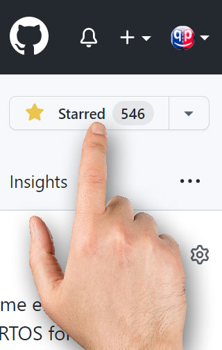

## Brought to you by:
[](https://www.state-machine.com)
<hr>

[](https://github.com/QuantumLeaps/spexygen/releases/latest)
[](https://github.com/QuantumLeaps/spexygen/blob/main/LICENSE)

<p align="center"></p>

# Spexygen - Traceable Specifications Based on Doxygen
**Spexygen** is a system for creating formal, [traceable](https://www.state-machine.com/qpc/fsm-qp_tr.html) specifications based on Doxygen, such as:

- functional safety specification ([example](https://www.state-machine.com/qpc/fsm-qp.html))
- requirements specification ([example](https://www.state-machine.com/qpc/srs-qp.html))
- architecture specification ([example](https://www.state-machine.com/qpc/sas-qp.html))
- design specification ([example](https://www.state-machine.com/qpc/sds-qp.html))
- source code ([example](https://www.state-machine.com/qpc/annotated.html))

# Use
Creating Spexygen documentation has the same workflow as Doxygen, except Spexygen
allows you to define formally traceable work artifacts and establish traceability
from downstream artifacts (e.g., code or tests) to upstream artifacts
(e.g., requirements). For any work artifact, Spexygen can **generate** the forward
traceability links, thus automating generation of **bidirectional** traceability.
The documentation files generated by Spexygen are then processed by Doxygen to
produce final documentation in various formats, such as HTML or PDF.


Suppose that you have the following directory structure:


```
+---spexygen/          // Spexygen (copy of this repo)
|       . . .
|       Spexyfile      // <== to be included in Doxyfiles
|       spexygen.py    // <== Python script to generate traceabilty
|
+---example/           // example documentation project
|   +---img/
|   |   Doxyfile       // @INCLUDE $(SPEXYGEN)/Spexyfile
|   |   main.dox
|   |   . . .
|   |   spexygen.json   // Spexygen configuration for traceability
```

1. Define the `SPEXYGEN` environment variable pointing to the Spexygen installation directory. This could be a relative path with respect to your `Doxyfile`. For example, if you intend to invoke Doxygen from the `my_docs/DOC-MAN-SX/` directory, you can define (on Windows):

```
set SPEXYGEN=../../spexygen
```

2. Include the `Spexyfile` at the top of your `Doxyfile`

```
# Doxyfile

# for definitions of alias commands for treacibility
@INCLUDE = $(SPEXYGEN)/Spexyfile

# defines generated files as INPUT for Doxygen processing
@INCLUDE = gen/doxyinc
. . .
```

3. Run Spexygen to generate traceability

```
python %SPEXYGEN%/spexygen.py
```

4. Run Doxygen in this directory:

```
doxygen
```

# Output

## HTML
Spexygen supports HTML output, nicely formatted using the
[doxygen-awesome theme](https://github.com/jothepro/doxygen-awesome-css).
In fact, Spexygen project is cloned from doxygen-awesome. By the nature of HTML,
the HTML ouptut provides the most comprehensive links (incling traceability links).

## PDF
Sexygen supports PDF output, with enhanced customized formatting. The items in the
PDF output is also linked, but the linking is necessarily limited to the single
document.

# Licensing
Spexygen is released under the terms of the permissive [MIT open source license](LICENSE).
Please note that the attribution clause in the MIT license requires you to preserve
the original copyright notice in all changes and derivate works.


# How to Help this Project?
Please feel free to clone, fork, and make pull requests to improve **spexygen**.
If you like this project, please give it a star (in the upper-right corner of your browser window):

<p align="center"></p>
